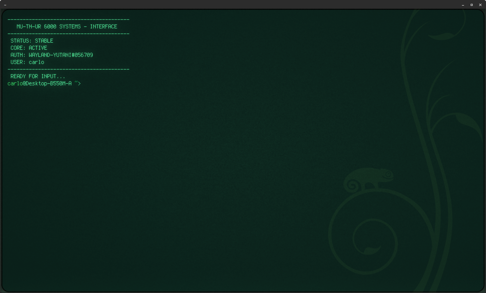
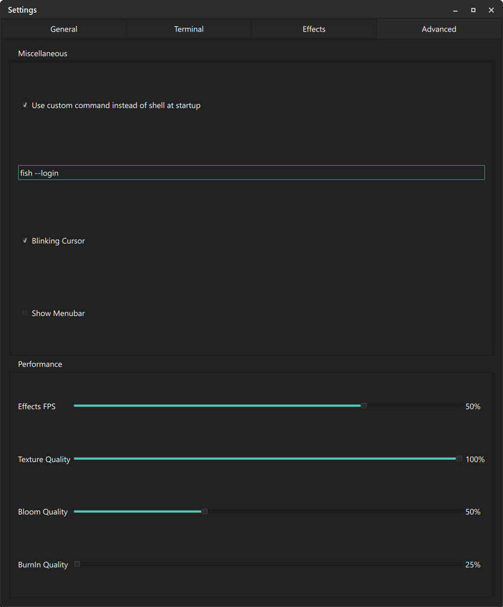

# MU-TH-UR 6000 Terminal Interface
**SERIAL: WAYLAND-YUTANI#056709**

> "Building Better Worlds"

This repository contains the official deployment script for the MU-TH-UR 6000 terminal interface. It transforms a standard Linux terminal into a high-fidelity workstation experience inspired by the USCSS Nostromo systems.
Cool Retro Term + Fish integration are recommended for an optimal experience.

## 🚀 Features
- **Dynamic Splash Screen**: Full system diagnostic and authorization sequence.
- **Ambient Audio Engine**: Constant background hum (Wait/Installation loops) using `SoX`.
- **Interactive Feedback**: Reactive sound effects for command execution and logout.
- **Automated Deployment**: Cross-distro installer for openSUSE, Fedora, Arch, and Debian/Ubuntu.

## 📦 Installation

### 1. Clone the Repository

git clone https://github.com/Citizen839X/MU-TH-UR-Terminal-Sounds.git
cd MU-TH-UR-Terminal-Sounds
chmod +x install_mother.sh
./install_mother.sh

## 🖥️ Recommended Setup: Cool-Retro-Term

For the authentic 2122 aesthetic (Amber/P3-Phosphor), we highly recommend using Cool-Retro-Term with the following configuration:

1.  Open Cool-Retro-Term.

2.  Go to Settings > Advanced.

3.  Locate the "Use custom command instead of shell at startup" option.

4.  Tick the checkbox to enable it.

5.  In the command line field, enter:
    fish --login

6.  Restart the terminal to initialize the MU-TH-UR sequence.

## ⚖️ License

This project is licensed under the GNU General Public License v3.0.
See the LICENSE file for full text.

Copyright (c) 2026 Carlo Sitaro

## 📷 Visual Interface

*MU-TH-UR 6000 Boot Sequence - Serial: WAYLAND-YUTANI#056709*

*Standard operating environment with active audio feedback.*
